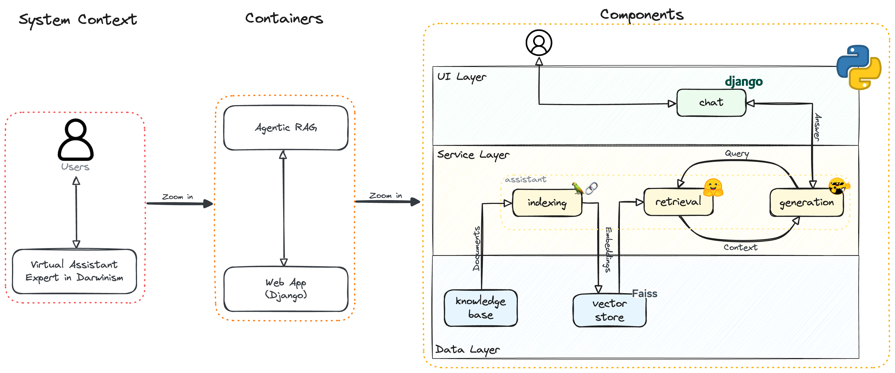

# GalapAssistant
### The AI that knows a lot about natural selection

<p align="center" style="margin: 3em">
  <a href="https://github.com/fsiconha/galapassistant">
    
  </a>
</p>

This little project provides an **assistant of the Galapagos Island**.
It's an AI, but it's like it was a person who was by Darwin's side while he absorbed all the knowledge to write the famous 'On the Origin of Species'.

## Installation

This project uses **Poetry** to dependencies management.

#### Set Up
```
$ git clone https://github.com/fsiconha/galapassistant.git
$ cd galapassistant
$ pip install poetry
$ poetry env use python3
$ poetry env activate
$ poetry install
```

#### Run Unit Tests
```
$ poetry run python3 scripts/run_unit_tests.py
```

## Usage

#### Start App
```
$ poetry run python3 scripts/manage.py runserver
```

#### Access App
```
http://127.0.0.1:8000
```

## Architecture

<p align="center" style="margin: 3em">
  <a href="https://github.com/fsiconha/galapassistant">
    
  </a>
</p>

